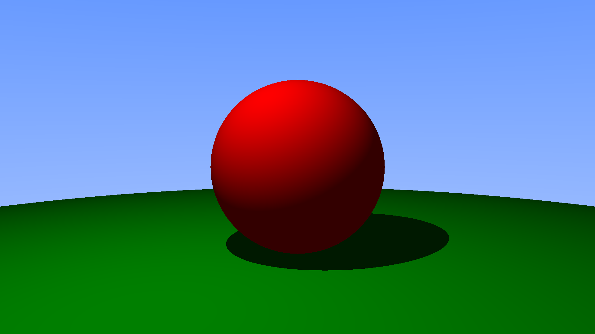
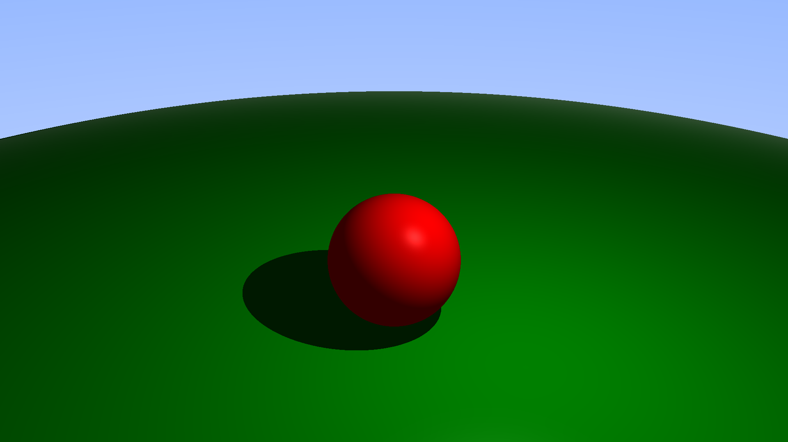

# RayTracing

A simple ray tracer based on Phong shading model.
It renders spheres, boxes and can be extended to any entity that implements intersection and normal methods.

## Usage

Create an entity vector, a light vector, a camera and add them to the scene.
Render the scene and export the image as png or jpeg.

## Development process

