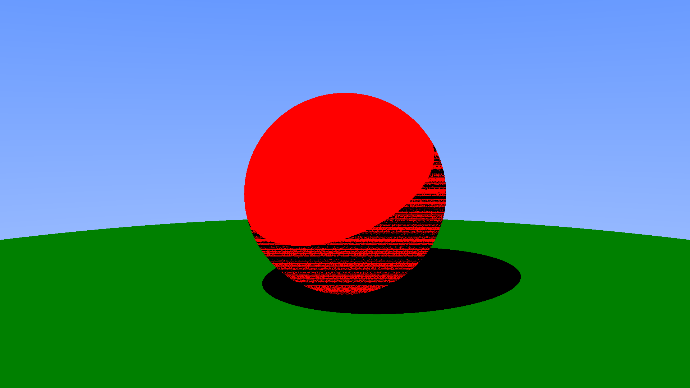

# RayTracing
A simple ray tracer based on Phong shading model.
It renders spheres, boxes and can be extended to any entity that implements an intersection and normal method.
<figure>
    
</figure>
## Usage
Create an entity vector, a light vector, a camera and add them to the scene.
Render the scene and export the image as png or jpeg.

## Development process
<figure>
    
    <figcaption>Background</figcaption>
</figure>
<figure>
    
    <figcaption>Sphere intersection</figcaption>
</figure>

